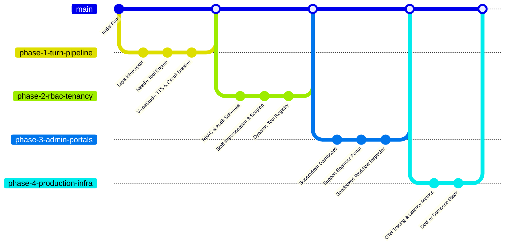

# Enterprise Implementation Spec & Architecture Plan
**Ultra-Low-Latency Voice SaaS Architecture (Dograh + Laya + Needle + VoiceStudio)**

---

## 1. Executive Summary & Codebase Review

### 1.1 Existing Codebase Findings
- **Backend (`api/`)**:
  - Built on **FastAPI** with async SQLAlchemy (`api/db/models.py`, `api/db/database.py`).
  - Core live pipeline uses **Pipecat** (`api/services/pipecat/pipeline_builder.py`, `service_factory.py`, `run_pipeline.py`).
  - Extensible processor pattern already established (e.g., `processors/answer_supervisor.py` manages barge-in/answering machine classification before the LLM aggregator).
  - Multi-tenancy is structured around `organizations` (`organization_id`), associated with users via `organization_users` and `selected_organization_id`.
  - Service provider registry (`api/services/configuration/registry.py`) defines LLM, STT, and TTS engines with Pydantic validation.
- **Frontend (`ui/`)**:
  - Built on **Next.js 15 (App Router)**, React 19, Tailwind CSS, shadcn/ui primitives, Zustand, and `@xyflow/react` for visual workflow canvases.
  - Basic `/superadmin` route already exists with rudimentary single-user impersonation.
  - Auto-generated OpenAPI client (`ui/src/client/`) generated via `@hey-api/openapi-ts`.

---

## 2. Target Architecture

```
                       [ Inbound Call (SIP / WebRTC) ]
                                      │
                                      ▼
                           [ Dograh API Gateway ]
                                      │
       ┌──────────────────────────────┴──────────────────────────────┐
       │                                                             │
  (Audio Stream)                                               (WebRTC Signaled)
       ▼                                                             ▼
[ Deepgram / Whisper STT ]                                 [ Audio Transport ]
       │
       ▼ (Streaming Transcripts)
┌────────────────────────────────────────────────────────────────────────┐
│ Turn Execution Pipeline (Sub-250ms)                                    │
│                                                                        │
│ 1. Laya Turn Interceptor (<35ms)                                       │
│    ├── should_interrupt()  ──▶ Real speech vs Backchannel ("uh-huh")   │
│    ├── security_guard()    ──▶ Prompt injection / Compliance check     │
│    └── emergency_route()   ──▶ Immediate Cold SIP Transfer / Escalation│
│                                                                        │
│ 2. Needle Fast-Path (<25ms)                                            │
│    ├── Tenant-scoped tool schema lookup                                │
│    ├── Deterministic execution (Orders, Bookings, Status)              │
│    └── Match found? ──▶ YES ──▶ Instant Response (Bypasses LLM)       │
│                      └▶ NO  ──▶ Fallback to System 2 Cloud LLM         │
│                                                                        │
│ 3. VoiceStudio Streaming TTS (<150ms TTFB)                             │
│    ├── Pre-cached Speaker Latents in Redis                             │
│    ├── Local Kokoro-82M / OmniVoice Streaming Engine                   │
│    └── Circuit Breaker (>450ms TTFB) ──▶ Failover to ElevenLabs/Aura   │
└────────────────────────────────────────────────────────────────────────┘
```

---

## 3. Phased Implementation Roadmap & Branch Strategy

Each phase will be developed on an isolated Git branch, thoroughly tested, and reviewed before merging into `main`.



---

### Phase 1: Sub-250ms Core Pipeline (`branch: feat/phase-1-turn-pipeline`)
**Goal:** Implement the ultra-low-latency 3-tier turn execution engine within `api/`.

1. **Module 1.1: Laya Fast Turn Interceptor**
   - **File:** `api/services/pipecat/processors/laya_interceptor.py`
   - **Features:**
     - Initialize `laya.Router(preload=True, device="cuda" if available else "cpu")` with graceful CPU fallback.
     - Evaluate `should_interrupt(text)`: Distinguish real interruptions from conversational backchannels ("yeah", "uh-huh", "got it") to avoid false VAD cutoffs.
     - Evaluate `security_guard(text)`: High-speed prompt-injection and compliance filter.
     - Evaluate `emergency_route(text)`: Detect urgent human escalation intent for immediate SIP REFER/transfer without LLM roundtrip.
     - Pipeline Hook: Placed immediately after STT and before context aggregators in `api/services/pipecat/pipeline_builder.py`.

2. **Module 1.2: Needle Fast-Path Extraction & Execution**
   - **File:** `api/services/pipeline/needle_runner.py`
   - **Features:**
     - Dynamic tenant-scoped tool compilation via Needle engine schemas.
     - Executes deterministic transactional intents (<25ms) directly into a response buffer.
     - Seamless fallback trigger: If Needle returns no match or tool execution fails, routes transparently to the configured System 2 LLM (Claude 3.5 Sonnet / GPT-4o / Gemini 2.5 Flash).

3. **Module 1.3: VoiceStudio Streaming TTS Provider & Circuit Breaker**
   - **Files:**
     - `api/services/pipecat/voicestudio_tts.py`
     - `api/services/configuration/registry.py` (Add `ServiceProviders.VOICESTUDIO`)
     - `api/services/configuration/options/voicestudio.py`
   - **Features:**
     - Subclass `TTSService` streaming raw 16kHz / 24kHz mono PCM audio chunks directly to WebRTC/telephony transports.
     - Redis caching for pre-warmed voice embeddings/latents to eliminate cold-start synthesis overhead.
     - Latency Circuit Breaker: Monitors Time-To-First-Byte (TTFB). If local TTS latency exceeds 450ms or errors out, automatically fails over mid-call to cloud TTS (ElevenLabs / Deepgram Aura) without dropping audio transport.

---

### Phase 2: Enterprise Multi-Tenancy & Hierarchical RBAC (`branch: feat/phase-2-rbac-tenancy`)
**Goal:** Implement strict 3-tier RBAC, audited staff impersonation, and isolated tenant environments.

1. **Module 2.1: Data Models & Migrations**
   - **File:** `api/db/models.py` (and Alembic migration)
   - **Entities:**
     - `UserRole`: `SUPER_ADMIN`, `SUPPORT_LEAD`, `SUPPORT_ENGINEER`, `SUPPORT_L1`, `TENANT_OWNER`, `TENANT_ADMIN`, `TENANT_BUILDER`, `TENANT_VIEWER`.
     - `OrganizationModel` enhancements: `status` (active, suspended, trial), `tier` (starter, enterprise), `concurrency_limit`, `features` flag JSON.
     - `SupportAuditLog`: Tracks `staff_user_id`, `tenant_id`, `action` (`VIEW_WORKFLOW`, `IMPERSONATE_SESSION`, `UPDATE_CONFIG`), `justification_ticket_id`, IP, and timestamp for SOC2/HIPAA compliance.

2. **Module 2.2: Auth Dependencies & Scoped Impersonation**
   - **Files:**
     - `api/services/auth/rbac.py`
     - `api/services/auth/depends.py`
   - **Features:**
     - Role-based authorization guards: `require_role(...)`, `require_staff(...)`, `require_super_admin(...)`.
     - Non-destructive impersonation: `X-Impersonate-Tenant-ID` header validation coupled with mandatory ticket justification header `X-Ticket-ID`.
     - Read-only impersonation mode for support engineers (L1/L2 cannot alter production workflows or initiate live outbound calls).

3. **Module 2.3: Dynamic Tenant-Isolated Tool Registry**
   - **File:** `api/services/pipeline/tenant_tool_registry.py`
   - **Features:**
     - Memory-isolated and tenant-scoped Needle tool instantiation.
     - Sandbox runtime prevents cross-tenant credential or context leakage.

---

### Phase 3: Admin & Support Portals UI (`branch: feat/phase-3-admin-portals`)
**Goal:** Deliver modern, responsive Next.js 15 administrative dashboards in `ui/`.

1. **Module 3.1: Super Admin Portal (`ui/src/app/(admin)/superadmin/`)**
   - **Tenant Directory:** Searchable, paginated organizations table displaying tier, active bots, real-time concurrency metrics, and status toggles.
   - **Staff & Role Management:** Provision and revoke internal staff users, assign RBAC tiers (`SUPPORT_L1`, `SUPPORT_ENGINEER`, `SUPPORT_LEAD`).
   - **Cluster Infrastructure Health:** Visual cards for VoiceStudio GPU workers, Redis queues, and SIP trunks.

2. **Module 3.2: Support & Engineering Portal (`ui/src/app/(admin)/support/`)**
   - **Tenant Lookup & Context Switcher:** Quick search by domain, email, organization name, or UUID.
   - **Read-Only Workflow Inspector:** Embed Dograh's React Flow canvas in a protected inspect-only mode (view prompts, node graphs, and tools without edit risk).
   - **Test & Debug Sandbox:** Side-by-side audio/text simulator showing real-time Laya intent classifications, Needle slot extractions, and latency watermarks.
   - **Call Log & Trace Explorer:** Search call logs with PII/PCI masking, span timelines (STT, Laya, Needle, LLM, TTS), and audio playback.

---

### Phase 4: Observability, Metrics & Production Docker Stack (`branch: feat/phase-4-production-infra`)
**Goal:** Production decoupling and complete containerization.

1. **Module 4.1: OpenTelemetry Spans & Telephony Metrics**
   - **Files:** `api/services/pipecat/tracing_config.py`, `api/services/pipecat/pipeline_metrics_aggregator.py`
   - **Metrics Tracked:**
     - `stt_duration_ms`
     - `laya_eval_ms`
     - `needle_tool_ms`
     - `llm_fallback_ms`
     - `tts_first_byte_ms`
     - `e2e_voice_turn_latency_ms`
     - Telephony stats: Packet loss, jitter, MOS score, and SIP hangup cause codes.

2. **Module 4.2: Production Docker Compose Specification**
   - **File:** `docker-compose.production.yml`
   - **Services:**
     - `dograh-api`: Core FastAPI backend with telephony gateway.
     - `dograh-ui`: Next.js 15 frontend with SSR and edge routing.
     - `voicestudio-tts`: CUDA-accelerated container running VoiceStudio (Kokoro-82M / OmniVoice) pre-warmed.
     - `laya-inference`: In-process or microservice container running `laya`.
     - `redis`: Session cache, speaker embedding cache, rate-limiting, and ARQ queue.
     - `postgres`: Application database with pgvector and tenant isolation.

---

## 4. Verification and Validation Strategy

| Phase | Test Strategy | Success Criteria |
| :--- | :--- | :--- |
| **Phase 1** | Pytest unit & mock streaming tests (`tests/services/pipecat/`) | - Laya backchannel filter ignores "uh-huh" without triggering interrupt.<br>- Needle executes tool in <25ms.<br>- VoiceStudio TTS streams PCM; circuit breaker fails over upon mock timeout. |
| **Phase 2** | Multi-tenant isolation & RBAC permission matrix tests | - Cross-tenant resource queries return 404.<br>- Support L1 receives 403 on write attempts.<br>- Impersonation fails without valid `justification_ticket_id`. |
| **Phase 3** | UI Vitest & Next.js route validation | - Superadmin pages load tenant metrics correctly.<br>- Support engineer view renders read-only workflow canvas with audit logging.<br>- Debug console parses mock turn events. |
| **Phase 4** | Docker healthchecks & end-to-end benchmark | - All 6 containers launch and pass healthchecks.<br>- P95 turn latency under 250ms on synthetic test calls. |
